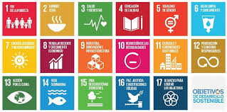
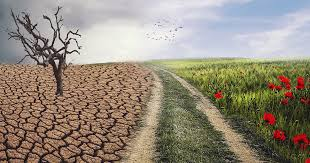
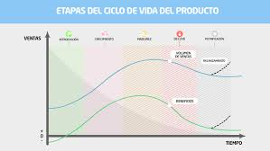

# Enero
### 9/1/2026

#### RESUMEN

-  Hoy hablamos de la agenda 2030, son 17 objetivos bondadosos creados en 2015 que se deben realizar antes de 2030. En principio no son criticables pero lo que si es criticable es la forma en la que lo hacen. 

#### PREGUNTA

- Se van a conseguir los objetivos de desarrollo sostenible?

- No, pero no porque sea imposible sino porque muchas organicaciones y empresas utilizan las ODS como una estrategia de marketing priorizando mas la imagen antes que acciones reales. Esto puede provocar una falsa percepcion de sostenibilidad , haciendo creer a la sociedad que se estan logrando avances cuando en realidad el impacto es negativo, debilita la credibilidad de los ODS, ya que se asocian con acciones superficiales en lugar de transformaciones reales, y beneficia a quienes no cumplen, ya que obtienen reconocimiento sin asumir los costos economicos o sociales de una transicion sostenible real.

#### OPINION PERSONAL

- Desde mi punto de vista, los ODS son una buena idea y tienen un objetivo importante, pero muchas veces no se aplican como deberían. En lugar de servir para generar cambios reales, a veces se usan solo para quedar bien o mejorar la imagen de empresas y gobiernos. Esto hace que la gente piense que se está avanzando cuando en realidad los problemas siguen ahí. Por eso creo que los ODS solo funcionan de verdad cuando hay compromiso real y acciones claras, y no solo palabras bonitas.

### 9/1/2026

#### RESUMEN

- Tema de hoy: Hemos hablado de la contaminacion, como afecta esto a nosotros y la posibles soluciones. Vimos los distintos tipos de contaminacion como los vertederos de dispositivos electronicos o el monstruo de las alcantarillas. Los microplasticos que ingerimos o respiramos pueden imitar nuestras hormonas provocando problemas de salud. Todos los residuos se acumulan en desiertos en diferentes partes del mundo.

#### PREGUNTA
- ¿Por que cambiaste tu ultimo telefono movil?

- Porque se rompio la pantalla y comprar otro era mas economico que repararlo. 

#### OPINION PERSONAL
- La contaminación es un problema que nos afecta a todos, no solo al planeta sino también a nuestra salud. Los microplásticos que respiramos o comemos pueden alterar nuestro cuerpo, y muchos residuos terminan acumulados en desiertos o vertederos sin realmente solucionarse. Creo que necesitamos cambiar nuestros hábitos de consumo y ser más responsables con lo que tiramos, porque cuidar el medio ambiente es cuidar también de nosotros mismos. 

# Diciembre
### 12/12/2025

#### RESUMEN

- Tema de hoy: Cambio climatico

- El cambio climatico es concebido como multiplicador de amenazas.

#### PREGUNTA 

- ¿Cual es el principal emisor de CO2?

La quema de productos fosiles 

- ¿Que puedo hacer yo como programador para mitigar el cambio climatico?

Hacer el codigo mas eficiente reduciendo el consumo electrico.

#### Opinion personal 

En mi opinión, el cambio climático es un problema grave que requiere la implicación de todos los sectores. Como programador, considero que tenemos una responsabilidad importante, ya que el uso de tecnologías digitales también consume muchos recursos energéticos. Optimizar el código, reducir procesos innecesarios y apostar por soluciones tecnológicas más sostenibles puede contribuir, aunque sea en pequeña escala, a la lucha contra el cambio climático.

### 05/12/2025
.jpg>)
#### RESUMEN

- Tema de hoy: Huella ecologica y huella de carbono
- La huella ecologica es la cantidad desechos que generan los seres vivos 
- La huella de carbono compara lo que consumimos contra lo que la Tierra puede generar.
- A partir de los años 50 se inicio las transformaciones socioeconomicas lo que genero un aumento contable del consumo de recursos.
- Las estartegias de mitigacion consisten en reducir, eficiencia y compensar.
- Hemos realizado una encuesta de la cantidad de recursos del medio ambiente que gastamos.

#### PREGUNTA 

- ¿Cuales tu huella de carbono?: 17.8 

#### Opinion personal 

En mi opinión, conocer nuestra huella ecológica y de carbono es fundamental para tomar conciencia del impacto que tenemos sobre el planeta. El resultado obtenido muestra que aún hay margen de mejora en nuestros hábitos de consumo. Creo que pequeños cambios en el día a día, como reducir el consumo de energía o usar medios de transporte más sostenibles, pueden contribuir a disminuir nuestra huella y cuidar mejor el medio ambiente.

# Noviembre
### 28/11/2025
.jpg>)
#### RESUMEN
- La economia lineal se basa en un flujo unidireccional de recursos. 

- Los principios clave de la circularidad es el ecodiseño, la prioridad y la integracion ecosistematica.

- La economia verde busca integrar la sostenibilidad ambiental en todas las secciones economicas.

#### Pregunta de la semana: 

##### ¿Y ami que me cuentas? ¿Enfoque colectivo o individual? 

Pienso que lo mas util es utilizar la economia circular con un enfoque colectivo. 

#### Opinion personal

En mi opinión, el enfoque colectivo es más efectivo porque permite que gobiernos, empresas y ciudadanos trabajen juntos para generar un impacto real y duradero. Aunque las acciones individuales son importantes, los cambios a gran escala solo se logran cuando existe cooperación y compromiso conjunto para aplicar los principios de la economía circular en la sociedad.

### 14/11/2025

#### RESUMEN

El peso oculto es la diferencia entre los que tenemos en la vida cotidiana y lo que se extrajo del medio ambiente. 

- Economia lineal: sus procesos son extraer, fabricar, consumir y desechar.

- Economia Circular: sus procesos son reducir y reutilizar.

- Ciclo de vida de los productos: Se estraen los recursos de la tierra, se fabrica el producto, transportan el producto a tiendas, el producto se utiliza y al final se desecha.

- La economia convencional oculta los procesos de extraccion y emision de los productos.

#### OPINION PERSONAL
En mi opinión, es importante conocer el peso oculto de los productos porque nos ayuda a ser más conscientes del impacto real que tienen nuestras decisiones de consumo sobre el medio ambiente. Creo que la economía circular es una alternativa necesaria frente a la economía lineal, ya que promueve un uso más responsable de los recursos y reduce la generación de residuos. Si los consumidores estuviéramos mejor informados, podríamos elegir productos más sostenibles y contribuir a un modelo económico más respetuoso con el planeta.

#### ¿Cuantas toneladas de embalaje hace falta para fabricar los elementos?

En un embalaje ligero hace falta 0.5 toneladas y en uno pesado 2.4 toneladas.

# OCTUBRE

### 3/10/25

- Semana 3: Miguel explico sobre como se relacionan los animales y humanos (Pregunta: ¿Acabaremos con la vida de nuestro planeta?: No)

### 10/10/25

- Semana 4: Miguel nos explico sobre los limites en la sociedad humana

### 17/10/25

- Semana 5: Miguel nos explico sobre como se relacionan los seres vivos

### 24/10/25

- Semana 6: estuvimos devatiendo si el universo es infinito

### 31/10/2025

- Miguel nos explico sobre la relacion entre lo ambiental y lo social.

# SEPTIEMBRE

### 19/9/25

- Semana 1: Miguel explica lo que vamos a hacer durante el curso.

### 26/9/25
-  Semana 2: Miguel explica el tema 1 sobre la sostenibilidad.

